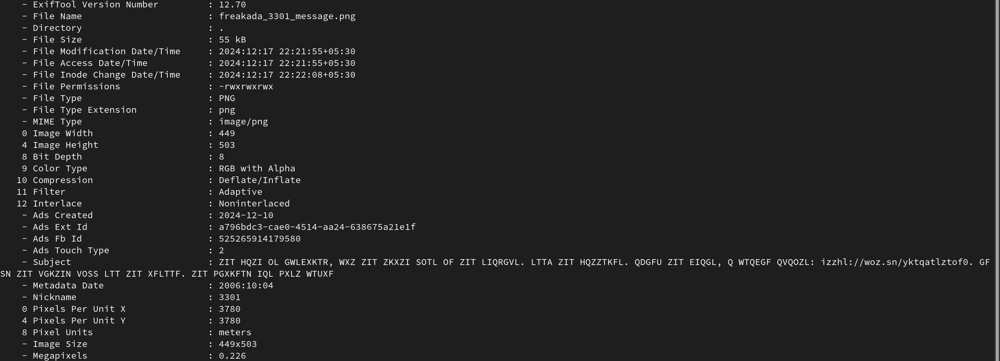
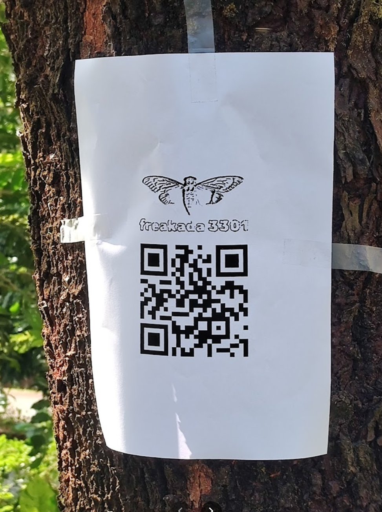
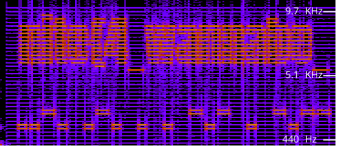

# freakada 3301

> We just freaky like that!

## About the Challenge

The challenge gives us an image with a hidden clue. This challenge is based on the famous Cicada puzzles. 

## How to solve

We got an image so we can use exiftool to get the header data of the image.

`exiftool -D freakada_3301_message.png`



From this we get a cypher `ZIT HQZI OL GWLEXKTR, WXZ ZIT ZKXZI SOTL OF ZIT LIQRGVL. LTTA ZIT HQZZTKFL. QDGFU ZIT EIQGL, Q WTQEGF QVQOZL: izzhl://woz.sn/yktqatlztof0. GFSN ZIT VGKZIN VOSS LTT ZIT XFLTTF. ZIT PGXKFTN IQL PXLZ WTUXF` which we can see contains a https link.

Using an online substiution solver (link [here](https://planetcalc.com/8047/)) I got the following:-

`THE PATH IS OBSCURED, BUT THE TRUTH LIES IN THE SHADOWS. SEEK THE PATTERNS. AVONG THE CHAOS, A BEACON AWAITS: HTTPS://BIT.LY/FREAKESTEIN0. ONLY THE WORTHY WILL SEE THE UNSEEN. THE MOURNEY HAS MUST BEGUN`

The link in lowercase is- HTTPS://bit.ly/freakestein0

From the website, we get another jpg (link [here](chal/ducky.jpg))

I used the following to command to extract any strings in the file and got a github link (https://github.com/freakada-3301)

`strings ducky.jpg`

The github profile had one repository where i found a part of the flag 

```
1sk3vr3d_qw5yvvc}
```

The commits showed that there was some datat before which was added and then deleted 


```
In the ruins of time, where decay whispers loud,
A species once scorned rose from the crowd.
Hungry for hope, though their ways seemed absurd,
They danced in the dark, defying the word.

How their stench carried tales of despair,
Yet in their odd rituals, a spark flared there.
The truth lay hidden in filth and grime,
As their wisdom evolved through ages of time.

They thrived where others could only fade,
With courage their crude civilization was made.
Putrid and proud, they stood undeterred,
Singing to stars with each guttural word.

A sign appeared, the days ticking by,
Seven strange omens lit up the sky.
The intellect buried in graveyard lore,
Held the key to humanity’s door.

They carved their symbols in earth and clay,
Willing the stars to show them the way.
Through odd numbers, the riddle was sung,
"From death comes life," in their guttural tongue.

A graveyard planet, a doomed last chance,
Brought salvation's glimmer in their dance.
The path to rebirth, though steep and gray,
Might just lie in their fetid display.

What’s unseen beneath this grotesque mirth?
The Answer that stirs from the depths of earth.
Symbols align as the stars hold their breath,
Hope reborn in the face of death.

Though shunned at first, these creatures grew,
A journey of worth the cosmos knew.
The 7 signs spoke of a rising tide,
An ascension to truth they couldn’t hide.

Realization came in whispers and cries,
That brilliance sometimes wears a crude disguise.
From 2nd chances and acts that seemed odd,
The beasts became more than a wink of God.

In their filth lay the universe's final quest,
Quest to unearth the future from decay’s cruel jest.
So seek them now, these saviors divine,
For the answers they hold may soon be mine.
```

AND

```
16:5:1
15:2:9
40:4:1
33:5:5
36:2:4
1:9:4 
23:4:4
25:5:6
5:3:5 
21:5:2
29:6:7
28:6:1
7:8:1 
18:1:7
30:1:1
16:1:1
30:2:1
31:2:1
33:1:1
35:2:1
38:1:1
11:6:3
```

Each set of numbers in part 2 corresponded to a character in the previous set of paras using the format `Line_no:Word_no:Character_index`

Using this format we get the following 

`httpsdiscordggAHj7R2Qd` 

which adding the correct special symbols becomes a discord invite link

`https://discord.gg/AHj7R2Qd`.

On the discord there was a bot named freakada. I sent it a hi and got the reply `INCORRECT`. This meant there is a correct value which will make the bot give either the flag or the next step.

Here it is important to learn about the cicada 3301 puzzles. Reading up on those puzzles, I found out that one of the challenges required using the product of the dimensions of the message image. 

So i calculated the product of the dimensions of this image , 449 * 503 and but this was not enough, so I multiplied 3301 to it and that worked. 

I got `13.34508015959565, 74.79629600750295` as a reply.

I entered these coordinates on google maps and looking around I found [this](https://maps.app.goo.gl/atYhG8xBmwfd47JB7) location .

Going through the comments, there was a qr code in one the of images 



This qr gave a link to an audio file (link [here](chal/freakmessage.wav))

Running it through an online spectrum analyzer i got the following



This has two parts

1. `nite{4_wannabe`
2. morse code that gets translated to `freekey`

Using freekey as a key for `1sk3vr3d_qw5yvvc}` and standard vigenere cipher, we get the complete flag

```
nite{4_wannabe_1nt3rn3t_my5tery}
```


